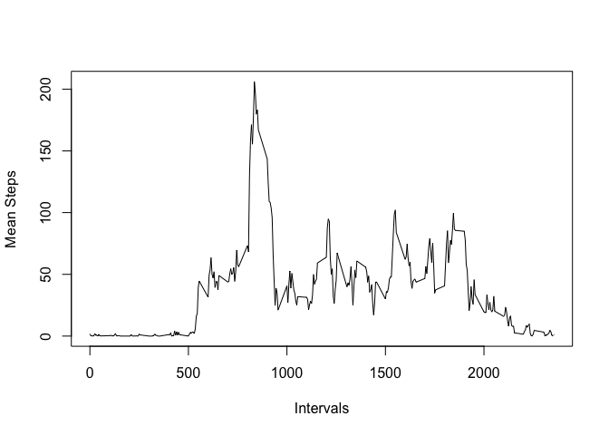

## Loading and preprocessing the data

First we load the data set and take a summary of it.


```r
unzip("./activity.zip")
data<-read.csv("./activity.csv")
str(data)
```

```
## 'data.frame':	17568 obs. of  3 variables:
##  $ steps   : int  NA NA NA NA NA NA NA NA NA NA ...
##  $ date    : chr  "2012-10-01" "2012-10-01" "2012-10-01" "2012-10-01" ...
##  $ interval: int  0 5 10 15 20 25 30 35 40 45 ...
```

We see that the date is character vector. So we convert it into Date.


```r
data$date<-as.Date(data$date)
```


## What is mean total number of steps taken per day?

We now calculate the total number of steps taken per day and plot a histogram.


```r
totSteps<-tapply(data$steps,data$date,sum)
hist(totSteps,xlab = "Date",ylab = "Steps", main = "Histogram of total steps")
```

<!-- -->

We now calculate the mean and median of the total number of steps taken on each day.


```r
meanSteps<-mean(totSteps,na.rm = T)
medianSteps<-median(totSteps, na.rm = T)
meanSteps
```

```
## [1] 10766.19
```

```r
medianSteps
```

```
## [1] 10765
```

## What is the average daily activity pattern?


To find out the average daily activity pattern, we first filter out the mean activity per interval across all the days and plot a graph.


```r
meanTimeSteps<-tapply(data$steps,data$interval,mean,na.rm=TRUE)
plot(names(meanTimeSteps),meanTimeSteps,type="l",xlab = "Intervals", ylab = "Mean Steps")
```

<!-- -->

### The plot reveals that the max occurs at somewhere between 700 and 800. To find that, we use which.max().


```r
 meanTimeSteps[which.max(meanTimeSteps)]
```

```
##      835 
## 206.1698
```

### This reveals that the maximum occurs at interval 835.

## Imputing missing values

Next we find the total number of NA's in the table:


```r
table(is.na(data$steps))
```

```
## 
## FALSE  TRUE 
## 15264  2304
```


```r
for(i in 1:nrow(data)){
  if(is.na(data[i,]$steps)){
    val<-meanTimeSteps[as.character(data[i,]$interval)]
    data[i,]$steps=val    
  }
}
```

Now we plot the histogram and also calculate the mean and the median.


```r
totSteps<-tapply(data$steps,data$date,sum,na.rm=TRUE)
hist(totSteps,xlab = "Date",ylab = "Steps", main = "Histogram of total steps without NA's")
```

<!-- -->

```r
meanSteps<-mean(totSteps)
medianSteps<-median(totSteps)
meanSteps
```

```
## [1] 10766.19
```

```r
medianSteps
```

```
## [1] 10766.19
```


### Thus we can conclude from the above that the mean does not change whereas the median changes little bit.

## Are there differences in activity patterns between weekdays and weekends?


We create the factor variable as follows:


```r
days<-weekdays(data$date)
for(i in 1:length(days)){
  if(days[i] %in% c("Monday","Tuesday","Wednesday", "Thursday","Friday")){
    days[i]="Weekday"
  }
  else{
    days[i]="Weekend"
  }
}
typeDay<-as.factor(days)
data["TypeOfDay"]=typeDay
```

Now inorder to plot the average of total steps taken during weekdays and weekends, we do the following:


```r
spl<-split(data,data$TypeOfDay)
meanTimeStepsDay<-tapply(spl$Weekday$steps,spl$Weekday$interval,mean,na.rm=TRUE)
meanTimeStepsEnd<-tapply(spl$Weekend$steps,spl$Weekend$interval,mean,na.rm=TRUE)
m<-numeric(length = nrow(data))
for(i in 1:nrow(data)){
  if(data[i,]$TypeOfDay=="Weekday"){
    m[i]<-meanTimeStepsDay[as.character(data[i,]$interval)]
  }
  else{
    m[i]<-meanTimeStepsEnd[as.character(data[i,]$interval)]
  }
}
data["mean1"]<-m
library(lattice)
xyplot(mean1~interval|TypeOfDay,data,type="l",layout=c(1,2),xlab = "Interval",ylab = "Number of steps")
```

<!-- -->

## Thats the end of the assignment. Thank You!

